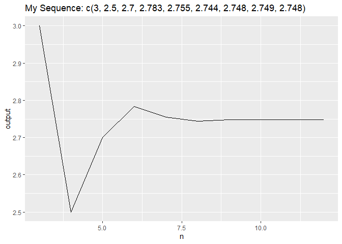

<!-- README.md is generated from README.Rmd. Please edit that file -->

# hw04dwjkate

<!-- badges: start -->
<!-- badges: end -->

The goal of hw04dwjkate is to use two functions myseq\_n() and
seq\_plot().

1.  myseq\_n() function is for creating a recursive sequence defined by
    given formula.

2.  seq\_plot() function is for creating a line plot of the output
    values of myseq\_n() function.

## Installation

You can install the released version of hw04dwjkate by contacting
“<dj1997a@student.american.edu>”

``` r
install.packages("hw04dwjkate")
```

## Test Example

``` r
library(hw04dwjkate)
```

### Recursive Sequence

``` r
myseq_n(x = c(2, 4, 3), n = 5)
#> [1] 2.7
myseq_n(x = c(2, 4, 3), n = 6)
#> [1] 2.783333
myseq_n(x = c(2, 4, 3), n = 7)
#> [1] 2.754762
```

### Sequence Plot

``` r
my_data <- tibble::tribble(
  ~x, ~y, ~z, ~n,
  2,4,3,3,
  2,4,3,4,
  2,4,3,5,
  2,4,3,6,
  2,4,3,7,
  2,4,3,8,
  2,4,3,9,
  2,4,3,10,
  2,4,3,12)

seq_plot(my_data)
```



# Author Information

Author Name: Dawoon (Kate) Jung

GitHub ID: dwjkate
